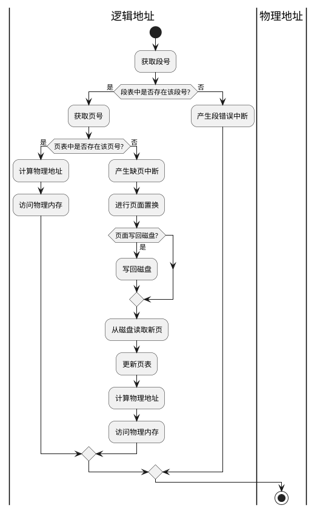

### 在动态分区内存管理技术中，有首次适应、循环首次适应、最佳适应和最差适应方法，有人说最佳适应方法的效果最差，而最差适应方法的效果最好，你同意这种说法吗？说明同意或不同意这种说法的原因。
最佳适应（Best Fit）方法会选择能够满足进程需求并且大小最接近的分区进行分配。这样可以避免出现大量碎片，但可能导致分区剩余空间较小，难以容纳大型进程。在高负载情况下，由于需要搜索所有可用分区，最佳适应方法的效率较低。

最差适应（Worst Fit）方法会选择剩余空间最大的分区进行分配。这样可以确保更多的大型分区可用，但会导致较多的外部碎片，并且不利于后续小型进程的分配。此外，最差适应方法在分配过程中也需要搜索所有可用分区，效率也相对较低。

综上所述，最佳适应和最差适应方法都有各自的优点和缺点。最佳适应方法有助于减少内存碎片，但效率较低；最差适应方法可以提供更多大型分区，但容易产生外部碎片。选择最适合特定环境和需求的算法很重要，可能需要考虑其他因素如系统负载、内存利用率和响应时间等。因此，无法一概而论某种方法效果最好或最差，需要根据具体情况进行评估和选择。

### 给出两个I/O设备与CPU之间的速度矛盾的例子，分析这种速度矛盾所导致的后果，并分别给出解决这种矛盾的技术，简述实现方案。
速度矛盾是指I/O设备与CPU之间的数据传输速度不匹配，可能导致系统性能下降或资源浪费。以下是两个常见的速度矛盾例子和解决方案：

硬盘与CPU速度矛盾：
硬盘的数据访问速度通常较慢，而CPU的处理速度较快。当CPU需要从硬盘读取大量数据时，硬盘速度矛盾可能会导致CPU等待磁盘操作完成，造成性能瓶颈。
解决方案：使用缓存技术。可以在内存中设置一个缓存区，将频繁访问的数据块缓存在缓存中，减少对硬盘的直接访问次数。当CPU需要访问数据时，首先检查缓存是否有数据，如果有，则直接从缓存读取，避免了硬盘访问延迟。

网络与CPU速度矛盾：
在网络通信过程中，数据传输速度通常比CPU的处理速度快。当CPU需要处理大量的输入/输出数据时，网络速度矛盾可能导致数据堆积，甚至丢失。
解决方案：使用流控制和缓冲区管理。流控制机制可以控制数据的发送速率，确保CPU能够及时处理接收到的数据。缓冲区管理可以将输入/输出数据暂存在缓冲区中，当CPU空闲时再进行处理，以平衡网络速度和CPU处理速度之间的矛盾。

这些解决方案都是通过增加额外的硬件或使用特定的算法来缓解I/O设备与CPU之间的速度矛盾。具体实现方案会根据不同的系统和设备而有所不同，需要根据具体情况进行设计和调整。

### 简述磁盘I/O调度算法SSTF的实现过程，分析其优缺点，并给出一种改进方法（说明基本思路和实现过程）。
SSTF（Shortest Seek Time First）是一种磁盘I/O调度算法，其基本思想是优先选择离当前位置最近的磁道进行访问。下面简要介绍SSTF的实现过程、优缺点以及一种改进方法。

实现过程：

当有新的磁盘请求到达时，计算当前磁头位置与请求磁道之间的距离，并将所有请求按照距离排序。
选择距离最近的磁道进行访问。
完成当前请求后，回到步骤1，处理下一个请求。
优点：

最大程度上减少了寻道时间，提高了磁盘访问效率。
对于某些特定的工作负载，可以获得较低的平均响应时间。
缺点：

可能会导致某些磁道长时间被忽略，形成饥饿现象。
在高负载情况下，容易造成请求长时间等待或积压，导致延迟增加。
改进方法：SCAN算法（也称为电梯算法）
基本思路：

SCAN算法基于电梯的运行原理，沿着一个方向进行磁头移动，直到到达磁道的最边缘，然后反向移动，继续处理请求。
SCAN算法保证了每个磁道都会被访问到，避免了饥饿现象。
实现过程：

当有新的磁盘请求到达时，将请求添加到合适的位置，按照磁头移动方向进行排序。
根据磁头当前的移动方向，沿着该方向依次处理请求，直到到达磁道的最边缘。
当到达磁道的最边缘后，改变移动方向，并继续处理请求，直到处理完所有请求。
该改进方法能够平衡磁盘上的请求分布，避免了某些磁道长时间被忽略的问题。然而，SCAN算法可能导致某些请求等待时间较长，因为它需要等待磁头移动到请求所在的磁道。因此，在选择I/O调度算法时，需要根据具体的工作负载和性能需求权衡各种因素。

### 列举出至少2种非剥夺式、3种剥夺式进程（作业）调度算法，简单分析其优缺点和应用场合。
非剥夺式进程调度算法：

先来先服务（First-Come, First-Served, FCFS）：按照进程到达的顺序进行调度，先到达的进程先执行。
优点：简单易实现，公平性较高。
缺点：可能会导致长作业效应，即短作业需要等待长作业执行完毕才能开始，造成响应时间较长。
应用场合：适用于对作业顺序没有特殊需求的场景，如批处理系统。

短作业优先（Shortest Job First, SJF）：选择估计运行时间最短的进程优先执行。
优点：能够最大程度地减少平均等待时间和平均周转时间，提高系统性能。
缺点：需要准确地预估每个进程的运行时间，难以实现准确的估计。
应用场合：适用于任务具有明确的预估运行时间，并且希望提高系统效率的场景，如交互式系统。

剥夺式进程调度算法：

轮转调度（Round Robin, RR）：将CPU时间分为若干个时间片，每个进程在一个时间片内执行，然后切换到下一个进程。
优点：公平性较高，保证每个进程都能及时获得CPU时间。
缺点：对于长时间执行的进程，可能会产生较高的上下文切换开销，并且响应时间不确定。
应用场合：适用于多用户系统和分时系统，能够平衡各个进程之间的资源竞争。

优先级调度（Priority Scheduling）：每个进程被赋予一个优先级，优先级高的进程先执行。
优点：能够根据进程的重要性和紧急性进行调度，满足不同进程的需求。
缺点：可能会导致低优先级进程饥饿，无法获得执行机会。
应用场合：适用于需要根据进程的优先级进行调度的场景，如实时系统或具有严格响应时间需求的应用。

### 在一个多用户（进程）系统中，磁盘文件读写是一个典型的“读者-写者”问题。
（1）试分析该问题中读者写者进程之间的制约关系，
（2）给出一个利用信号量机制解决“读者写者”问题的方案（要求：不存在死锁、饿死情况；说明所用信号量的含义和初值；描述读者、写者处理流程）。

（1）在多用户系统中的读者-写者问题中，读者和写者进程之间存在一定的制约关系。具体来说，多个读者可以同时读取文件，但不能同时进行写入操作。当有一个写者正在执行写入操作时，其他读者和写者都必须等待。此外，如果有写者等待写入操作，则不允许新的读者进入。

（2）解决读者-写者问题的一种常见方法是使用信号量机制。可以使用三个信号量来实现，分别是mutex、rw_mutex和read_count。它们的初值分别为1、1和0。

读者处理流程如下：

检查是否有写者正在写入，如果有，则等待。
获得互斥锁mutex，将read_count加1。
如果是第一个读者，获得读者写者锁rw_mutex。
释放互斥锁mutex。
执行读取操作。
将read_count减1。
如果是最后一个读者，释放读者写者锁rw_mutex。
写者处理流程如下：

检查是否有读者或写者正在进行操作，如果有，则等待。
获得互斥锁mutex。
执行写入操作。
释放互斥锁mutex。
通过这种方式，可以实现读者和写者的互斥操作，确保在同一时间只有一个写者或多个读者访问文件。同时，也避免了死锁和饿死情况的发生。

### 在一个段页式虚拟存储管理系统中，
（1）主要需要哪些数据结构？
（2）画出指令执行时的地址映射（逻辑）流程图
（3）分析这种虚拟存储管理方法的优缺点；
（4）针对分析结果，分别给出改进方案。

（1）在一个段页式虚拟存储管理系统中，主要需要以下几个数据结构：

页表：用于将逻辑地址映射到物理地址的数据结构。它存储了每个页的基址和限长信息。
段表：用于将逻辑地址中的段号映射到段的物理地址的数据结构。它存储了每个段的基址和限长信息。
页表目录：用于索引页表的数据结构。它存储了页表的基址信息。
全局页表：用于存储整个虚拟地址空间的页表信息，提供全局的页表访问支持。
此外，还可能会涉及到其他一些数据结构，如缓存、页替换算法所使用的数据结构等。

（3）段页式虚拟存储管理方法的优点包括：

支持更大的虚拟地址空间：通过将地址空间划分为段和页，可以支持更大的虚拟地址空间，满足更多进程的需求。
提供更好的内存保护：通过段表和页表，可以将不同的段或页面进行隔离，实现更好的内存保护机制，防止进程之间的干扰。
实现了非连续性地址空间分配：段页式虚拟存储管理方法使得进程的地址空间可以分布在物理内存的不同位置，从而实现了非连续性的地址空间分配。
缺点包括：

需要更多的内存开销：由于需要额外的数据结构来管理段和页的映射关系，段页式虚拟存储管理方法需要更多的内存开销。
增加了访问开销：由于需要多次地址转换，段页式虚拟存储管理方法会增加访问内存的开销，导致系统性能下降。
（4）根据上述分析结果，可以考虑以下改进方案：

使用更高效的数据结构：可以通过使用更高效的数据结构来减少内存开销，如使用哈希表或树结构来存储页表信息。
优化地址转换算法：可以考虑使用快速的地址转换算法，如使用快表（Translation Lookaside Buffer, TLB）来缓存部分页表项，加快地址转换过程。
预读和预写技术：可以通过预读和预写技术来减少访问内存的开销，提高系统性能。
这些改进方案可以根据具体的需求和系统环境进行选择和优化，以提升段页式虚拟存储管理方法的效率和性能。

### UNIX文件目录由名号目录项和索引结点组成，假定索引结点中包含13个盘块号索引项，其中一次间接、二次间接和三次间接索引各1项。同时假定盘块大小为8KB，盘块号（指针）为32位（其中8位用于标识物理磁盘，24位用于标识物理块）。
(1)名号目录项和索引结点有何关系？
(2)该系统所支持的最大文件是多大？
(3) 该系统所支持的最大分区是多大？
(4) 如果一个文件的逻辑记录大小为3KB、不跨块存储，那么访问该文件的13,423,956号记录，需要几次访问磁盘？（要求给出计算过程）